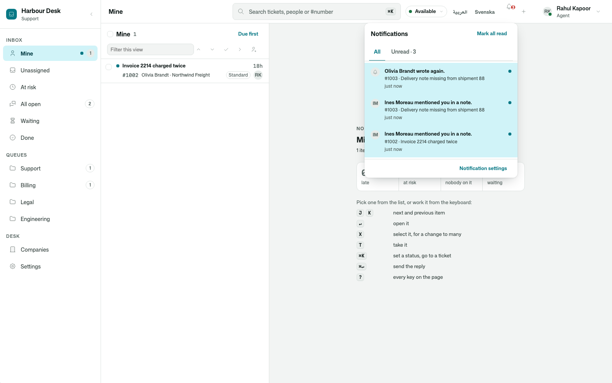
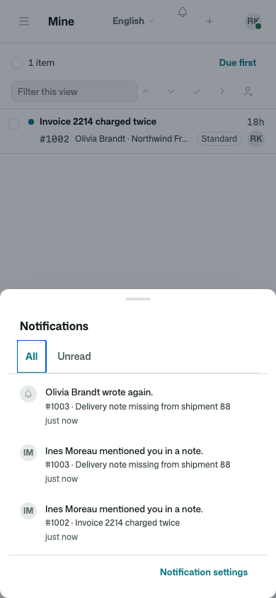
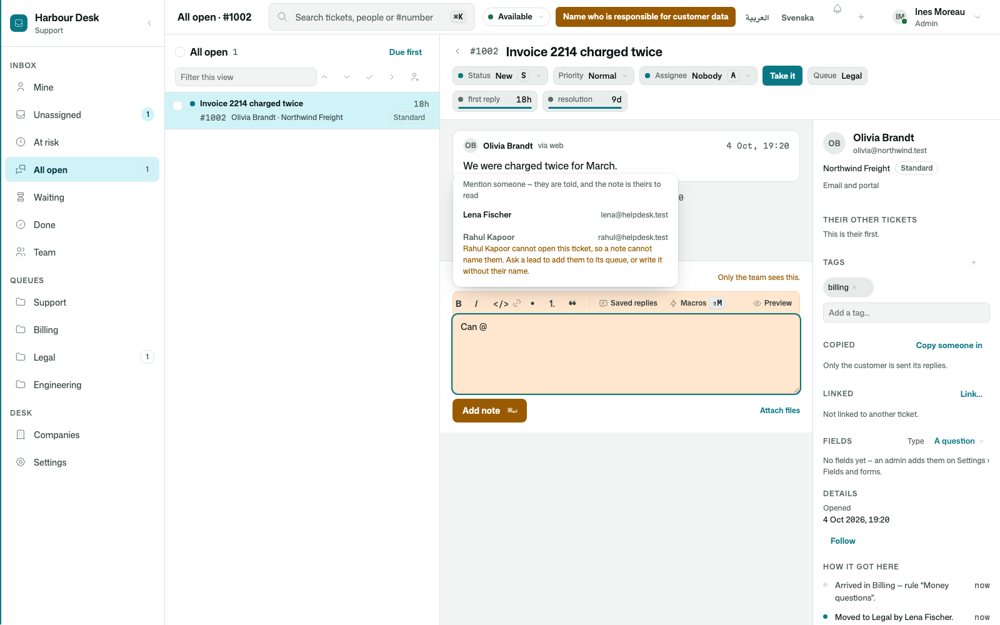
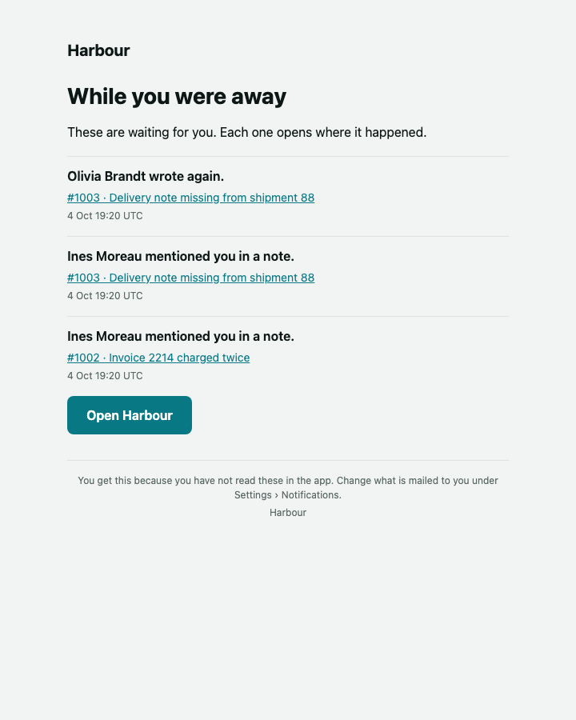

# Osysharp.Notifications

Telling a person that something needs them. A bell beside their name with a live count and a list behind it — read
and unread, All / Unread, "Mark all read", each row opening where it happened — and, for what they did not see in the
app, a mail: a daily digest, or a mention at once. Each person chooses; each person reads it in their own language.

**Use case.** A support team where a ticket is offered to Rahul while he is on another screen; a colleague writes
`@Rahul Kapoor can you check the refund?` in a note; the customer writes again on a ticket he follows; a promise on his
ticket is at risk. Each reaches his bell at once, and what he has not read by morning is in one mail. The same kit
tells an approver that a purchase waits for them, or a privacy officer that a request is due — it never knows what a
ticket is.

```osy
use Osysharp.Notifications@1;

policy ReceivesNotifications => IsAgent;                        // who has a bell
partial entity Notification { security { allow create when IsAgent; } }   // who may tell from their own request
app.Notifications = new NotificationsSetup { AppName = "Harbour" };

[Event("Customer wrote again")]                                 // what happened — your own event, or any kit's
public sealed class CustomerWrote {
  public Ticket Ticket;
  public override string Sentence() { return $"{Ticket.Customer.DisplayName} wrote again."; }   // said when READ
}

[Title($"#{Number} · {Title}")] entity Ticket { … }                       // what a ticket is called
[Route("/w/{view}/t/{number}")] [Opens(Ticket, view = "mine")] component TicketPage(…) { … }   // where it opens

Notify(rahul, new CustomerWrote { Ticket = ticket });           // about the record the event is about
[On] void TellReviewers(ArticleSentForReview e) { NotifyAll(reviewers, e); }   // a kit's event, told as it is
Mention(rahul, ticket, by: Session.CurrentUser);                // a mention is the kit's own
NotificationBell();                                             // in the shell's actions
```

## What it does

| | |
|---|---|
| **Durable delivery** | a notification is written in the caller's commit and delivered after it by a workflow (retried on a throw) — nobody hears about something rolled back |
| **Only what they may read** | the record's own security, as the recipient (`Records.MayRead`) — asked at delivery; the bell reads each record as its reader and the digest asks once per person (`Records.Readable`), so a record they lost access to leaves the bell and the mail |
| **About any record** | a notification's `About` is an `Entity`: what it is called and where it opens are the record's own `[Title]` and the page that `[Opens]` it — the kit asks nothing of the app about them — and it goes with its record (`[OnDelete(Remove)]`) |
| **One unread per thing** | a second notification with the same key joins the unread one ("2 times"), held by the database |
| **The bell** | `NotificationBell()` — count in its accessible name, a panel wide, a sheet on a phone, empty and caught-up states designed |
| **Mail** | per person, on their own settings page: mentions at once (after a short wait, only if still unread) and the rest daily; daily only; or nothing — always in their language |
| **The event, not its sentence** | a notification keeps the event itself and says it with the event's own `Sentence()` when it is read — in the reader's language, with the event's records read as they may read them; an event that says nothing of its own says its label |
| **Retention** | read ones after 30 days, unread after 180, never-shown after a day — an hourly sweep |
| **Privacy** | the event it keeps is `Personal.Content`; with `Osysharp.Privacy`, Osysharp.Privacy.Notifications — which arrives by itself — counts, copies, restricts and erases a person's notifications and preferences |

## Screens

| | |
|---|---|
| The bell open, wide |  |
| On a phone |  |
| A mention, offered as you type |  |
| The daily digest |  |

## Its tests

The kit's test app is a small studio's shared drafts, so the kit is shown working outside a helpdesk; the
[Harbour helpdesk](https://osyrin.com/templates/helpdesk/) uses it end to end. Who may read a notification is
`osy docs stdlib-records`.
